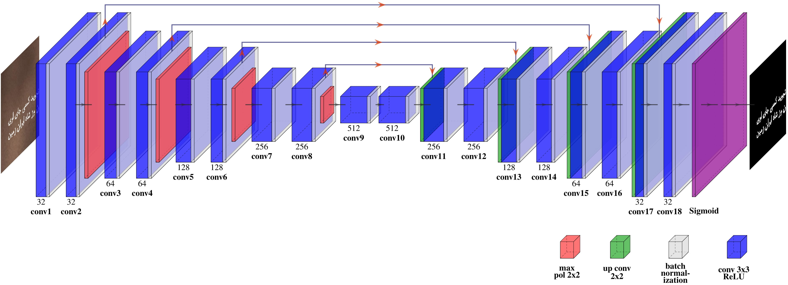
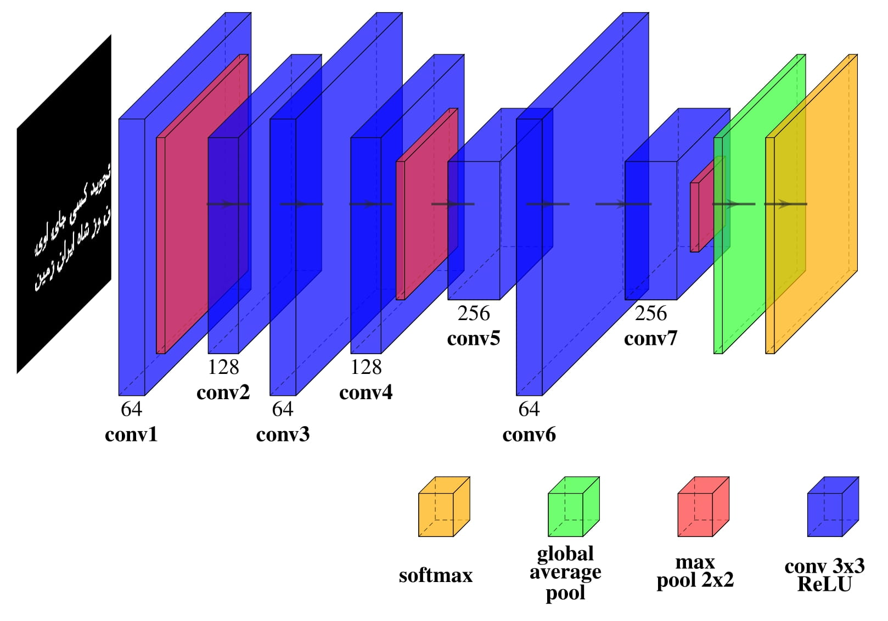

# Persis: A Persian Font Recognition Pipeline Using Convolutional Neural Networks


## 📖 Paper
**Publisher:** IEEE

**Link:** https://ieeexplore.ieee.org/document/9960037

**Authors:** Mehrdad Mohammadian, Neda Maleki, Tobias Olsson, Fredrik Ahlgren


## 📊 Datasets


Avaiable Datasets:
- The Persian Font Recognition (PFR) 
- The Persian Text Image Segmentation (PTI SEG) 

## 📬 Send your request
These datasets are available only for research purposes. So please fill out the below "Google Form" carefully.

[Google Form](https://docs.google.com/forms/d/e/1FAIpQLScyDsPJ9PUXrae6X6mlOxjnZw4xV03BEJhSPoThZkh5YsnwXw/viewform?usp=sf_link)

## ⚙️ Architecture

Segmentation part:


Classification part:



## ✍️ Citation
```
@INPROCEEDINGS{9960037,  author={Mohammadian, Mehrdad and Maleki, Neda and Olsson, Tobias and Ahlgren, Fredrik},  booktitle={2022 12th International Conference on Computer and Knowledge Engineering (ICCKE)},   title={Persis: A Persian Font Recognition Pipeline Using Convolutional Neural Networks},   year={2022},  volume={},  number={},  pages={196-204},  doi={10.1109/ICCKE57176.2022.9960037}}
```

## 📧 Contact
email:  mehrdad.mhmdn@gmail.com
