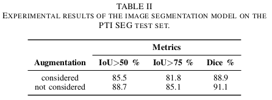

# Persis: A Persian Font Recognition Pipeline Using Convolutional Neural Networks


## 📖 Paper
**Publisher:** IEEE

**Link:** https://ieeexplore.ieee.org/document/9960037

**Authors:** Mehrdad Mohammadian, Neda Maleki, Tobias Olsson, Fredrik Ahlgren

**Abstract:**
What happens if we see a suitable font for our design work but we do not know its name? Visual Font Recognition (VFR) systems are used to identify the font typeface in an image. These systems can assist graphic designers in identifying fonts used in images. A VFR system also aids in improving the speed and accuracy of Optical Character Recognition (OCR) systems. In this paper, we proposed the first publicly available datasets in the field of Persian font recognition and employed Convolutional Neural Networks (CNN) to address the Persian font recognition problem. The results show that the proposed pipeline obtained 78.0% top-1 accuracy on our new datasets, 89.1% in the IDPL-PFOD dataset, and 94.5% in the KAFD dataset. Furthermore, the average time spent in the entire pipeline for one sample of our proposed datasets is 0.54 and 0.017 seconds for CPU and GPU, respectively. We conclude that CNN methods can be used to recognize Persian fonts without the need for additional pre-processing steps such as feature extraction, binarization, normalization, etc.


## 📊 Datasets


Avaiable Datasets:
- Persian Font Recognition (PFR) 
- Persian Text Image Segmentation (PTI SEG) 

## 📬 Send your request
These datasets are available only for research purpose. So please fill out the below "Google Form" carefully.

[Google Form](https://docs.google.com/forms/d/e/1FAIpQLScyDsPJ9PUXrae6X6mlOxjnZw4xV03BEJhSPoThZkh5YsnwXw/viewform?usp=sf_link)

 ## ⚙️ Architecture


## 📈 Results




## ✍️ Citation
```
@INPROCEEDINGS{9960037,
  author={Mohammadian, Mehrdad and Maleki, Neda and Olsson, Tobias and Ahlgren, Fredrik},
  booktitle={2022 12th International Conference on Computer and Knowledge Engineering (ICCKE)},
  title={Persis: A Persian Font Recognition Pipeline Using Convolutional Neural Networks},
  year={2022},
  volume={},
  number={},
  pages={196-204},
  doi={10.1109/ICCKE57176.2022.9960037}
}
```

## 📧 Contact
email:  mehrdad.mhmdn@gmail.com
